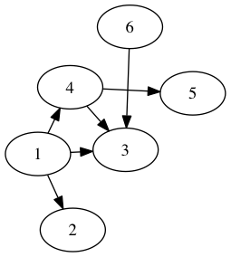
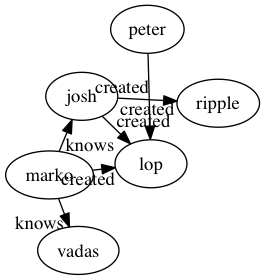

gremlin-graphviz
================

Use Graphviz to visualize Gremlin graphs.

This module is a mashup of [ts-tinkerpop](http://github.lab.redseal.net/redseal/ts-tinkerpop) and
[node-graphviz](https://github.com/glejeune/node-graphviz).

## Usage

You must first install the Graphviz package in a platform-specific manner.

Check out all of the unit tests and examples for more, but here is [a taste](examples/baseline.js):

And an example [with labels](examples/labels.js):

